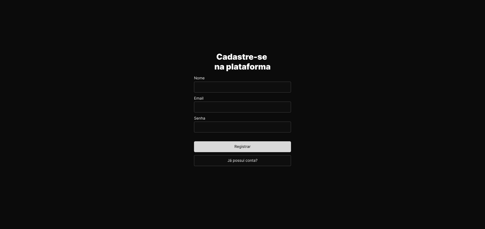
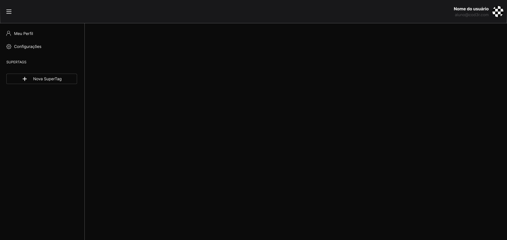
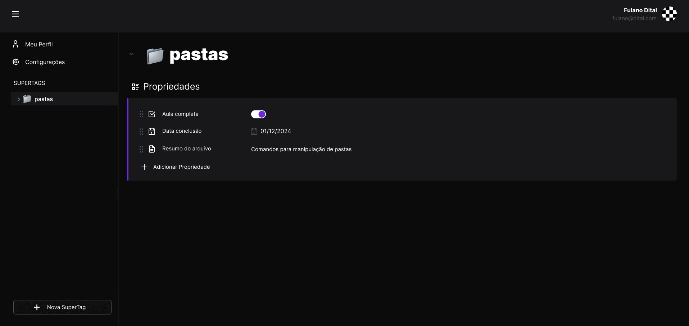
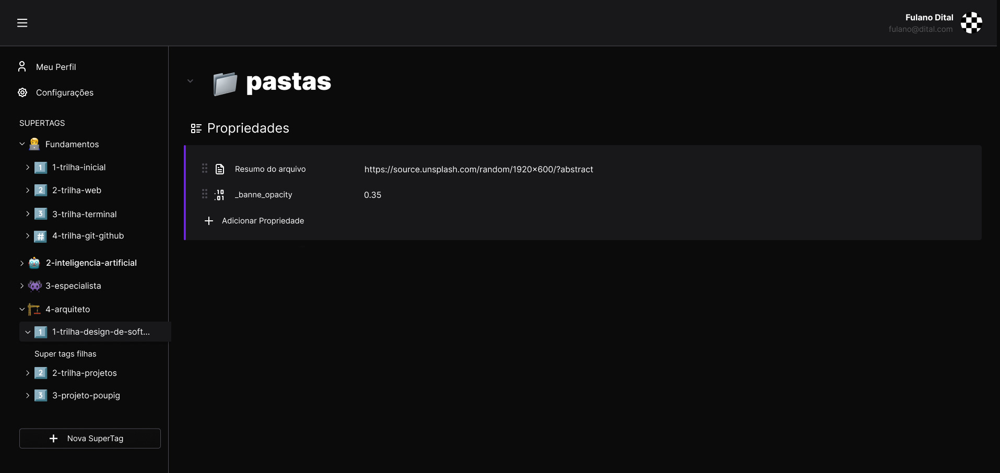
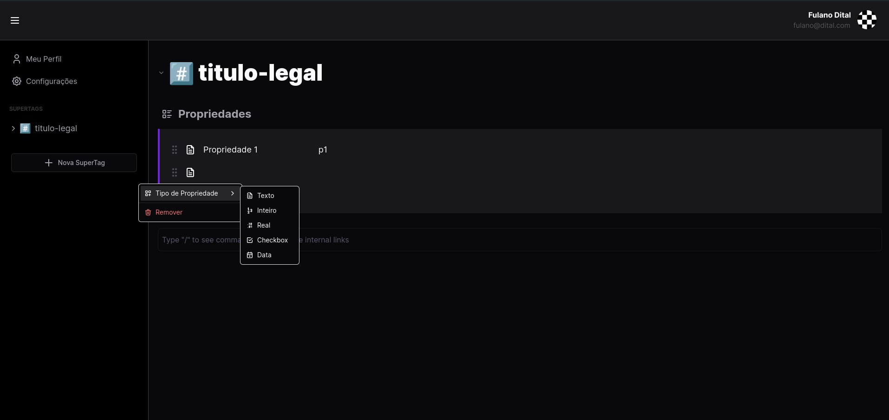
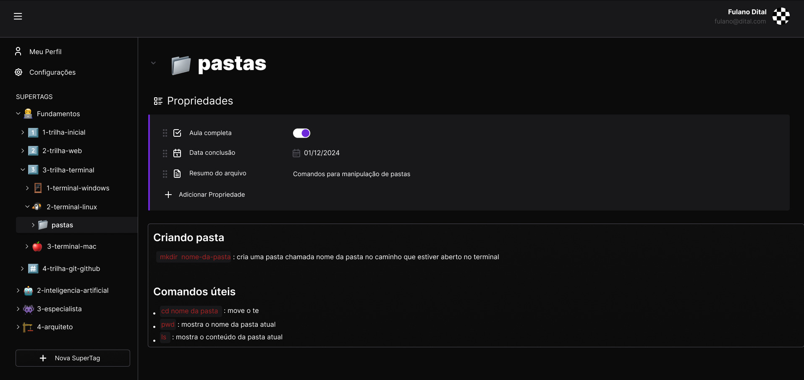
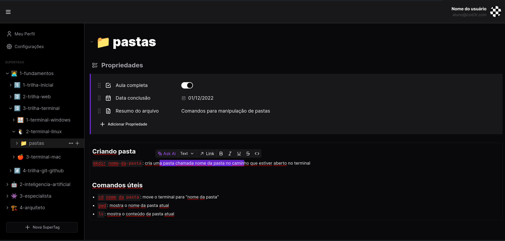

> [Clique aqui para acessar o vídeo de apresentação do projeto](https://www.youtube.com/watch?v=8MqdNAY52XA)

## Etapa 1 - Autenticação

### Requisitos Funcionais:

1. **Registro de usuário**:

   - Um usuário deve conseguir criar uma conta na aplicação provendo nome, email e senha.
   - Um usuário só poderá se registrar na aplicação se possuir uma senha forte
   - Caso haja algum problema no registro, o usuário precisa ser avisado disso através de algum feedback visual

2. **Login**:

   - Um usuário deve fazer login na aplicação utilizando e-mail e senha
   - Ao fazer login, o usuário precisa ser redirecionado para a parte interna da aplicação que não estará disponível para usuários não logados
   - Caso haja algum problema no login, o usuário precisa ser avisado disso através de algum feedback visual

3. **Logout**:

   - Um usuário deve conseguir se deslogar da aplicação uma vez que esteja na parte interna da aplicação
   - Ao se deslogar, o usuário deve retornar para a lágina de login

4. **Sessão**
   - Ao fazer o login, a sessão do usuário deve se manter ativa por um período de tempo (exemplo, uma semana), ou seja, se o usuário fechar o navegador nesse intervalo de tempo, ao abrí-lo novamente dentro do período de tempo estipulado, ele deve continuar logado

### Detalhes Adicionais:

1. **Frontend**

   - O Frontend da aplicação deve conter telas as telas de login, registro de usuário, e a página interna da aplicação onde é possível fazer logout
   - A página interna da aplicação só deve ser acessível para usuários logados

2. **Backend**

   - O Backend deve ser desenvolvido pela equipe
   - É de responsabilidade do Backend gerar um token para validação de usuário
   - O backend deve persistir dados em um banco de dados

### Imagens de Referência

## Etapa 2 - Criação de uma SuperTag

### Requisitos funcionais:

> Dica: Para essa etapa, não se preocupe com a criação das páginas, crie uma única página e a utilize para a implementação de todos os componentes necessários.

1. **Definir o título de uma página**:

   - O usuário deve poder alterar o título de uma página que será inicializada com um valor padrão
   - Além de um valor textual, o título da página deve conter um emoji para sua identificação
   - A página deve possuir um emoji padrão
   - Ao clicar no emoji, deve ser possível selecionar um emoji de uma lista para substituir o emoji padrão
   - Ao clicar no título da página, deve ser possível alterá-lo

2. **Propriedades**:

   - Uma página deve conter uma lista de propriedades cujos tipos pode ser selecionado entre os tipos da lista abaixo:
     - texto
     - número inteiro
     - número real
     - chechbox
     - data
   - Uma propriedade deve ter um valor que possa ser editado de acordo com o tipo da propriedade
   - A lista de propriedades de um documento pode ser colapsada
   - Uma propriedade pode ser excluida pelo usuário

3. **Salvamento automático**:
   - O salvamento da página (contendo título e propriedades) deve ser feito automaticamente no banco de dados
   - Ao abrir a página, esta deve ser preenchida com as últimas alterações feitas pelo usuário

### Imagens de Referência

## Etapa 3 - Árvore de Tags

### Requisitos funcionais:

1. **Criar uma nova SuperTag**:

   - O usuário deve conseguir criar uma SuperTag a partir de um menu lateral no formato de árvore

2. **Criar uma nova tag filha**:

   - O usuário deve conseguir criar uma tag filha associada a uma SuperTag.
   - Além de criar uma tag associada a uma SuperTag, é possível que tags também tenham tags filhas

3. **Colapsar lista de Tags**:

   - O usuário deve conseguir exibir todas as tags filhas de uma determinada tag, ou fechar essa visualização

4. **Exclusão de tags**:

   - Uma tag, ou uma SuperTag, devem poder ser excluidas pela interface.
   - Ao excluir uma SuperTag, suas tags filhas também serão excluidas.

### Imagens de Referência

## Etapa 4 - Editor de Texto

> Dica: Existem vários editores de texto ricos no mercado e você pode optar por integrar um desses editores no projeto ao invés de desenvolver a sua própria versão

1. **Editor de texto**:

   - O usuário deve ter a sua disposição um editor de texto
   - O conteúdo do editor de texto deve ser salvo automáticamente junto com as propriedades e título da página
   - O editor deve ter as seguintes funcionalidades de estilização básicas:
     - Negrito
     - Itálico
     - Sublinhado
     - Código
   - Ao selecionar uma palavra, deve aparecer um menu de estilização com as funcionalidades citadas acima e ao clicar em uma das opções do menu, o texto deve manter aquela formatação
   - Deve ser possível adicionar ao texto um link externo para outra página através do menu de estilização

### Imagens de Referência

## Etapa 5 - Funcionalidades Extras [opcional]

- Implementar a funcionalidade de drag and drop no menu lateral onde são mostradas as SuperTags
- Implementar um menu de comandos especiais que aparecerá quando um símbolo específico for digitado no editor onde é possível escolher uma das estilizações abaixo:
  - Título 1 (equivalente ao `<h1>`)
  - Título 2 (equivalente ao `<h2>`)
  - Título 3 (equivalente ao `<h3>`)
  - Lista ordenada (equivalente ao `<ol>`)
  - Lista não ordenada (equivalente ao `<ul>`)
  - Imagem (equivalente ao ``)
  - Link (equivalente ao `<a>`)
- Adicionar no editor de texto um comando especial para listar as tags (páginas) presentes na aplicação e fazer o link de uma página seleiconada com o texto que está sendo escrito, permitindo que a página selecionada seja acessível a partir desse link
- Integrar algum modelo de inteligência artificial para geração de texto no editor de texto da aplicação
- Implementar o fluxo para que o usuário faça o upload de uma imagem de perfil

## Materiais de apoio sugeridos

### Cursos da Formação sugeridos:

Obs: Não é necessário ter feito todos os cursos para participar do projeto, mas se houverem dúvidas, esses cursos são um bom ponto de consulta.

- Fundamentos.DEV > Trilha Git e GitHub > Git e Github Básico
- Fundamentos.DEV > Trilha Git e GitHub > Git e Github Branches
- Especialista.DEV > Trilha React&Next > Fundamentos de React
- Especialista.DEV > Trilha React&Next > React com Tailwind CSS
- Especialista.DEV > Trilha React&Next > Next.JS
- Especialista.DEV > Trilha Banco de Dados > Banco Relacional
- Especialista.DEV > Trilha Banco de Dados > SQL
- Especialista.DEV > Trilha Banco de Dados > Banco NoSQL
- Especialista.DEV > Trilha Banco de Dados > Iniciando com MongoDB
- Especialista.DEV > Trilha Backend > API com Express JS
- Especialista.DEV > Trilha Backend > Persistência com Knex.js
- Especialista.DEV > Trilha Banco de Dados > Persistência com Mongoose

### Outros conteúdos sugeridos:

#### Youtube da Cod3r

- [Conceitos Essenciais: O Básico de HTTP](https://www.youtube.com/watch?v=CXzbUwK6lc8)
- [Criando uma Aplicação do Zero a Nuvem Usando o TurboRepo](https://www.youtube.com/watch?v=SQy5we_2L7Y)
- [Backend limpo](https://www.youtube.com/watch?v=5p5sE62bBVs)

#### Blog da Formação

- [Aprendendo a lidar com erros](https://blog.formacao.dev/aprendendo-a-lidar-com-erros/)
- [Instalando o PostgreSQL no Windows](https://blog.formacao.dev/instalando-o-postgresql-no-windows/)
- [Como armazenar senhas de usuários](https://blog.formacao.dev/como-armazenar-senhas-de-usuarios/)
- [Github Desktop](https://blog.formacao.dev/github-desktop/)
- [O que é o arquivo .gitignore](https://blog.formacao.dev/o-que-e-o-arquivo-gitignore/)
- [Validações com o pacote validator](https://blog.formacao.dev/validacoes-com-o-pacote-validator/)
